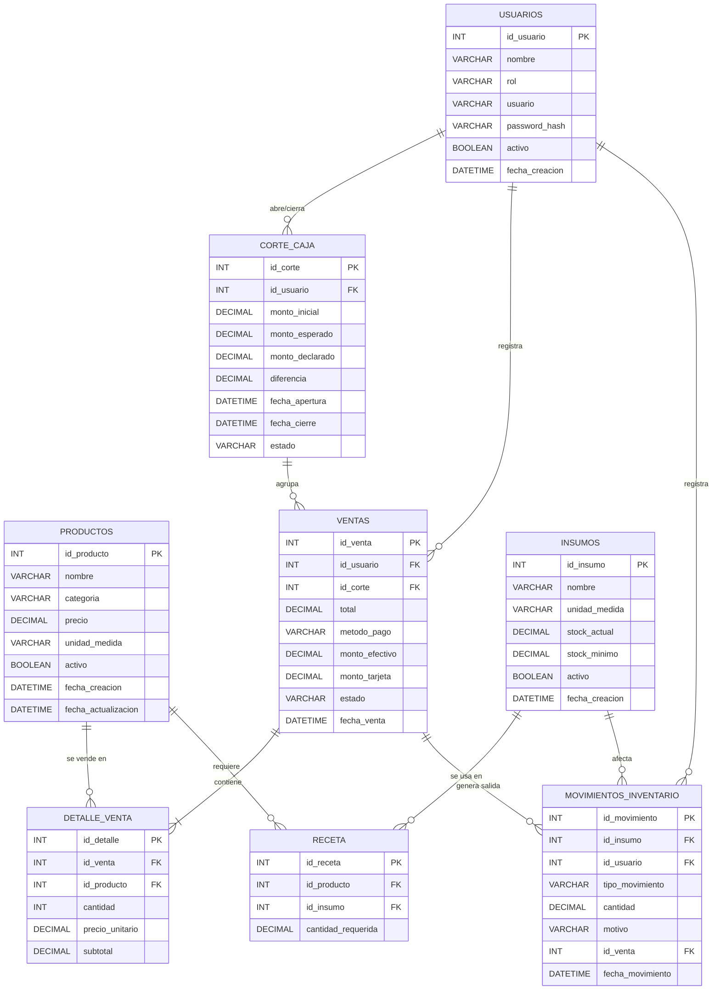

# Modelo de Datos — POS Cafetería

## 1. Diagrama Entidad-Relación (Mermaid)

> Nota: se incluye la tabla `usuarios` como entidad de apoyo, ya que `ventas`,
> `corte_caja` y `movimientos_inventario` referencian al usuario que las
> generó (requisito de auditoría definido en el spec, secciones 4.1 y 4.3).
> El diagrama cubre productos, ventas, detalle_venta, corte_caja e inventario
> (insumos, receta, movimientos_inventario).

---

## 2. Script SQL

El script completo de creación de tablas (DDL) se separó al archivo
[`schema.sql`](./schema.sql), que incluye:

- `usuarios` (tabla de apoyo para auditoría)
- `productos`
- `corte_caja`
- `ventas`
- `detalle_venta`
- `insumos`
- `receta`
- `movimientos_inventario`
- Índices recomendados para reportes

---

## 3. Notas de diseño

- **Precio histórico (sección 4.7 del spec):** `detalle_venta.precio_unitario` se captura al momento de la venta y es independiente de `productos.precio`, para que cambios futuros de precio no alteren ventas pasadas.
- **Inmutabilidad de ventas (sección 4.2):** no se incluyen UPDATE de campos críticos de `ventas` vía la app; las correcciones se hacen cambiando `estado` a `'anulada'`, nunca editando montos o productos.
- **Relación venta–corte de caja:** toda venta debe pertenecer a un corte de caja abierto (`id_corte` es `NOT NULL`); esto refleja HU-13/HU-14, donde no puede haber venta sin caja abierta.
- **Tipos decimales:** se usa `DECIMAL(10,2)` en lugar de `FLOAT`/`DOUBLE` para evitar errores de redondeo en montos monetarios, conforme a la restricción 4.2 del spec.
- **Tablas no incluidas en este alcance:** ninguna — el modelo ya cubre productos, ventas, detalle_venta, corte_caja e inventario (insumos, receta, movimientos_inventario), completando todo lo definido en el spec original.

## 4. Notas adicionales del módulo de inventario

- **Trazabilidad de stock (HU-09, HU-10, HU-12):** todo cambio de `insumos.stock_actual` debe quedar reflejado como un registro en `movimientos_inventario` (entrada, salida por venta o ajuste manual), nunca como una actualización "silenciosa" del stock. El campo `stock_actual` en `insumos` actúa como caché del saldo, recalculable a partir del historial de movimientos.
- **Relación con ventas (HU-10):** cuando una venta se confirma, el sistema debe generar automáticamente un movimiento de tipo `salida_venta` por cada insumo de la receta de cada producto vendido, multiplicado por la cantidad vendida. El constraint `chk_movimiento_venta_coherente` obliga a que todo movimiento de tipo `salida_venta` tenga un `id_venta` asociado.
- **Reversión por anulación (HU-07):** si una venta se anula, debe generarse un nuevo movimiento de tipo `entrada` (o un movimiento compensatorio) por los insumos correspondientes, en lugar de borrar el movimiento original — esto preserva el historial de auditoría.
- **Alertas de stock bajo (HU-11):** se calculan comparando `insumos.stock_actual` contra `insumos.stock_minimo`; no requiere una tabla adicional, puede resolverse con una consulta o vista (`stock_actual <= stock_minimo`).
- **Receta como N a N:** la tabla `receta` modela que un producto puede requerir varios insumos y un insumo puede usarse en varios productos, con la cantidad específica de consumo por producto.
